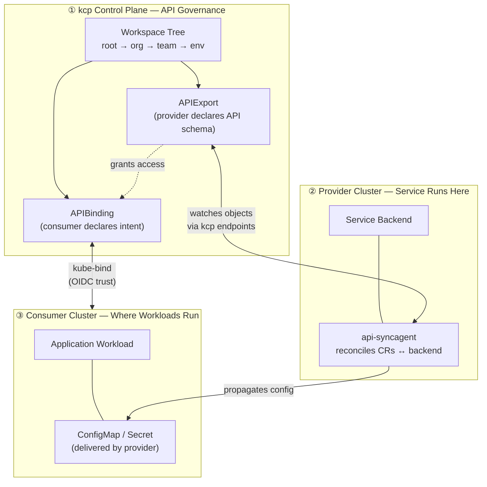
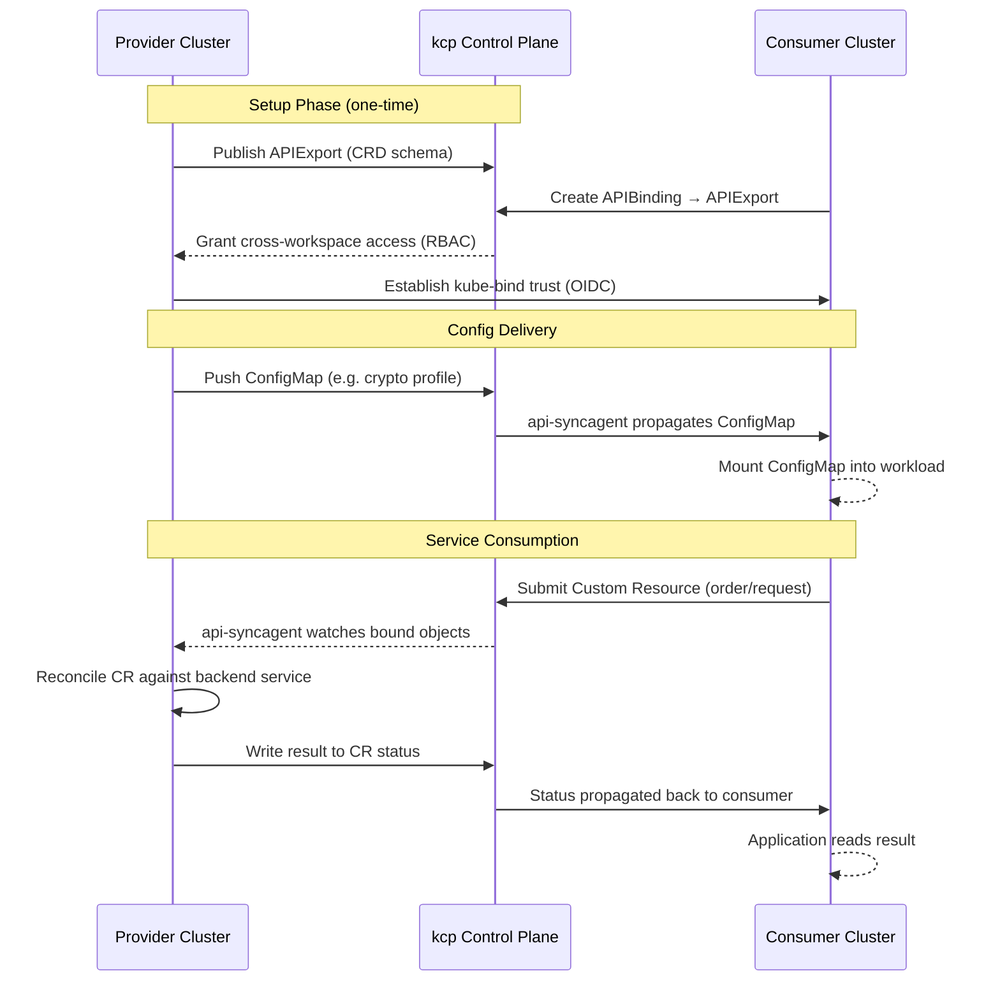
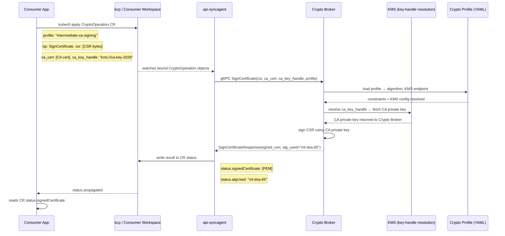
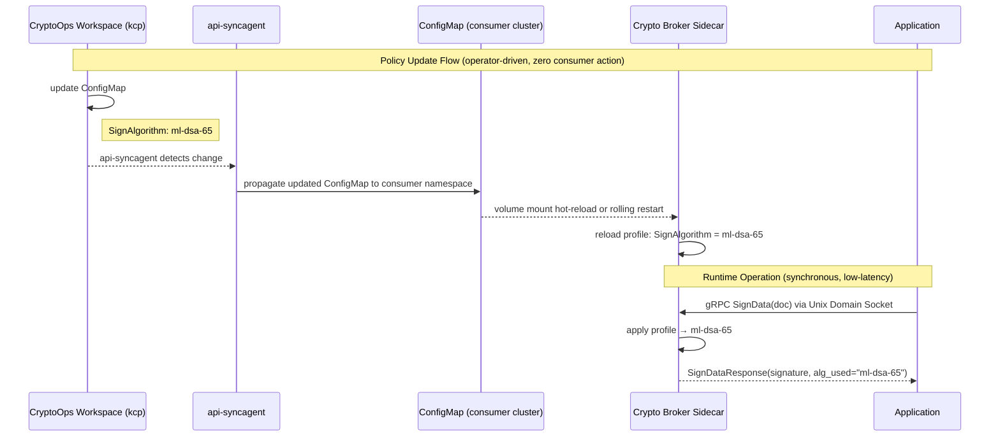
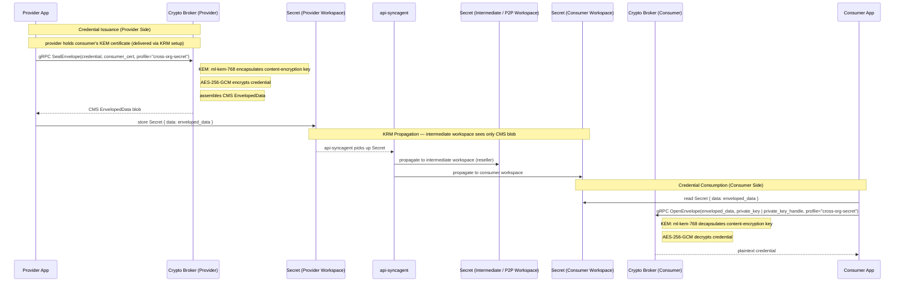
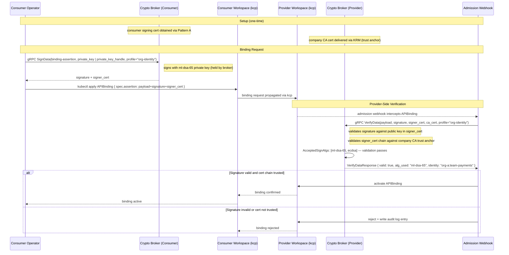

# Crypto Broker + Platform Mesh Integration Guide

## Overview

Platform Mesh ([release-0.2](https://platform-mesh.io/release-0.2/)) is an open-source service management framework (Linux Foundation Europe / NeoNephos Foundation) that enables service providers and consumers to discover, order, and orchestrate services across Kubernetes clusters, organizations, and teams. It builds on the Kubernetes Resource Model (KRM) and [kcp](https://kcp.io) to provide hierarchical multi-tenant control planes, a declarative `APIExport`/`APIBinding` marketplace pattern, and OIDC-based cross-cluster trust.

The Crypto Broker and Platform Mesh operate at complementary layers:

> **Platform Mesh answers:** *Which service, from which provider, consumed by which team, governed by which account hierarchy?*
>
> **Crypto Broker answers:** *Which algorithm, which parameters, which policy, validated by which compliance boundary?*

Neither system answers the other's question. Together they close the gap between service mesh governance and cryptographic governance — a gap that becomes critical when services cross organizational or cluster boundaries, where neither side can assume the other's cryptographic posture.

---

## 1. Platform Mesh Architecture

### 1.1 Architecture Overview

Platform Mesh is structured in three layers that work together:

1. **kcp control plane** — A stripped-down Kubernetes API server that provides hierarchical *workspaces* as isolated control planes, without any container scheduling. This is the backbone of the Platform Mesh account model.
2. **Provider and consumer clusters** — Real Kubernetes clusters where workloads run. They connect to the kcp control plane via `APIExport`/`APIBinding` and `kube-bind`, but remain self-governed.
3. **Bridging tooling** — `api-syncagent` reconciles objects between provider and consumer workspaces; `kube-bind` establishes authenticated cross-cluster relationships.

The workspace tree mirrors the organizational hierarchy (`root → org → team → environment`). Each workspace is an isolated API surface — a team's workspace can only see the APIs its `APIBinding` declarations have granted it access to.



**Key flows in the diagram:**

- A provider publishes an `APIExport` in their workspace, defining the CRD schema they offer.
- Consumer teams create `APIBinding` objects in their workspaces, referencing the provider's export. The provider grants access; OIDC establishes trust between clusters.
- Once bound, consumer teams submit Custom Resource objects (orders) in their own workspace. `api-syncagent` watches these objects via kcp's special cross-workspace endpoints and reconciles them against the actual provider backend.
- Provider-managed configuration (profiles, credentials, secrets) flows back to consumer clusters via `api-syncagent` propagation, mounted into workloads as standard Kubernetes `ConfigMap`s or `Secret`s.
- All authorization is enforced by Kubernetes RBAC; provisioned access extends only to the APIs declared in the `APIExport` — no broader cluster access is granted.

The sequence diagram below shows the same three phases over time — setup, config delivery, and service consumption:



---

### 1.2 Core Components

| Component | Role |
|---|---|
| **kcp** | Stripped-down Kubernetes control plane providing KRM-based API orchestration without container scheduling |
| **Workspaces** | Hierarchical isolated control planes mapping to organizational account structures (org → team → environment) |
| **APIExport** | Provider-side declaration of a service API schema made available for consumption |
| **APIBinding** | Consumer-side declaration of intent to consume a provider's exported API |
| **api-syncagent** | Bridges APIExport/APIBinding boundaries; remaps API objects between provider and consumer namespaces |
| **kube-bind** | Establishes cross-cluster API binding relationships with OIDC authentication |
| **KRO** | Kubernetes Resource Orchestrator — manages resource graphs for complex service compositions |

### 1.3 Service Exchange Scenarios

Platform Mesh defines three exchange topologies:

| Scenario | Description | Status |
|---|---|---|
| **P2C** (Provider to Consumer) | Service provider exposes APIs; internal teams or external customers bind and consume | Available |
| **P2P** (Provider to Provider) | Providers cross-sell or compose services from other providers before offering to their consumers | Available |
| **C2C** (Consumer to Consumer) | Digital twin scenarios; service extensions between consumer teams | Planned |

### 1.4 Trust and Security Model

Platform Mesh enforces security through:

- **OIDC authentication** between clusters for cross-workspace trust
- **Kubernetes RBAC** governing all `APIExport`/`APIBinding` interactions
- **Secret exchange via KRM**: `Secret` objects carry credentials across workspace boundaries as part of the service contract
- **Minimal exposure principle**: Providers expose only the APIs defined in their `APIExport`; no broader cluster access is granted

---

## 2. Complementary Roles

| Concern | Platform Mesh | Crypto Broker |
|---|---|---|
| Service discovery | `APIExport` marketplace; consumers browse available exports | — |
| Service binding | Declarative `APIBinding`; OIDC-authenticated cross-cluster | — |
| Multi-tenancy | Hierarchical workspaces (org → team → environment) | Profile per deployment context (Section 10, Whitepaper) |
| Secret delivery | KRM `Secret` objects propagated via api-syncagent | — |
| Secret content protection | — | `SealEnvelope`/`OpenEnvelope` (CMS EnvelopedData: KEM + AES-256-GCM, broker-internal); KEM certificates via Pattern A |
| Algorithm policy | — | YAML profile; operator-controlled, CISO-enforced |
| Algorithm migration | — | Profile update + migration window (`AcceptedXxx` lists) |
| Cross-boundary audit | RBAC-logged APIBinding events; per-workspace audit | Structured logs with `traceId`; algorithm identity per operation |
| Correlated audit trail | Workspace-scoped event log | `traceId` propagated across workspace boundaries via gRPC metadata |
| Crypto lifecycle (key rotation, algorithm upgrade) | — | `GenerateKey` API (Pattern B — local/consumer-cluster context); profile-driven rotation workflow |
| PQC readiness | — | Profile: `ml-dsa-65`, `ml-kem-768`, hybrid modes |
| Kubernetes-native deployment | Workspaces, ConfigMaps, Secrets, RBAC | Sidecar container; ConfigMap-mounted profiles; rolling update |

---

## 3. Integration Patterns

### Pattern A — Crypto Broker as a Platform Mesh Managed Service

> **Architectural note:** Pattern A is a **KRM-mediated remote async service**, not a standard Crypto Broker client deployment. The consumer application never calls the Crypto Broker client library (`crypto-broker-client-go`, `crypto-broker-client-js`, etc.) directly. Instead, it submits a Kubernetes Custom Resource and polls its status; the provider-side reconciler operator is the only component that holds a Crypto Broker client and calls the broker via Unix Domain Socket. The UDS constraint is satisfied exclusively on the provider cluster. This distinction affects latency, integration contract, and appropriate use cases — see the Limitations section below.
>
> **Certificate Authority analogy:** For `SignCertificate`, this architecture is not a compromise — it is the standard CA trust model. A client submits a CSR over HTTPS to a CA endpoint; the CA signs it using a private key held internally in an HSM or KMS; the client receives the signed certificate and never sees the signing key. Pattern A with the key-handle pattern maps directly onto this model: the consumer submits a `CryptoOperation` CR (containing the CSR) over HTTPS/KRM; the reconciler forwards it to the Crypto Broker; the broker resolves the CA private key from a KMS internally; the signed certificate is returned via CR status. The Crypto Broker + KMS pair functions as the CA's signing backend. The async polling model even mirrors ACME, where certificate issuance is an order/status cycle.

**Topology:** The Crypto Broker is published as a first-class Platform Mesh service via `APIExport`. Consumer teams bind to it and submit cryptographic operation requests as Kubernetes Custom Resources — without deploying their own broker instances and without using the Crypto Broker client library.

```
┌──────────────────────────────────────────────────────────────────────────────┐
│  Consumer Cluster                                                             │
│                                                                               │
│  ┌───────────────────────────────────────────────────────────────────────┐   │
│  │  Consumer Workspace (kcp)  ·  APIBinding → 'crypto-broker-v1'         │   │
│  │                                                                        │   │
│  │  ┌──────────────────────────┐  kubectl apply   ┌───────────────────┐  │   │
│  │  │  Consumer App / GitOps   ├────────────────► │ CryptoOperation   │  │   │
│  │  │                          │  (HTTPS / KRM)   │       CR          │  │   │
│  │  │  No Crypto Broker client │                  │                   │  │   │
│  │  │  lib — uses kubectl or   │ ◄── poll status  │ spec:             │  │   │
│  │  │  Kubernetes client only  │                  │   op: Sign...     │  │   │
│  │  └──────────────────────────┘                  │   csr: [bytes]    │  │   │
│  │                                                │   ca_key_handle:  │  │   │
│  │                                                │    kms://ca-2026  │  │   │
│  │                                                │ status:           │  │   │
│  │                                                │   signedCert: PEM │  │   │
│  │                                                │   algUsed:        │  │   │
│  │                                                │    ml-dsa-65      │  │   │
│  │                                                └───────────────────┘  │   │
│  └───────────────────────────────────────────────────────────────────────┘   │
└──────────────────────────────────────────────────────────────────────────────┘
                  │
                  │  api-syncagent  (HTTPS · OIDC/RBAC · cross-workspace)
                  │
                  ▼
┌──────────────────────────────────────────────────────────────────────────────┐
│  Provider Cluster                                                             │
│                                                                               │
│  ┌───────────────────────────────────────────────────────────────────────┐   │
│  │  Provider Workspace (kcp)  ·  APIExport 'crypto-broker-v1'            │   │
│  │                                                                        │   │
│  │  ┌───────────────────────┐          ┌──────────────────────────────┐  │   │
│  │  │  Reconciler Operator  │          │  Crypto Broker Server        │  │   │
│  │  │                       │          │                              │  │   │
│  │  │  crypto-broker-       │  Unix    │  ┌────────────────────────┐  │  │   │
│  │  │  client-go            │  Domain  │  │  Profile Engine        │  │  │   │
│  │  │                       │  Socket  │  │  /etc/profiles.yaml    │  │  │   │
│  │  │  watches bound CRs    │◄────────►│  │  (ConfigMap mount)     │  │  │   │
│  │  │  via kcp endpoints    │          │  └───────────┬────────────┘  │  │   │
│  │  │                       │          │              │ algorithm      │  │   │
│  │  │  writes result to     │          │              ▼ policy        │  │   │
│  │  │  CR status            │          │  ┌────────────────────────┐  │  │   │
│  │  └───────────────────────┘          │  │  Crypto Provider       │  │  │   │
│  │                                     │  │  (Sign / Hash / Verify)│  │  │   │
│  │                                     │  └───────────┬────────────┘  │  │   │
│  │                                     └──────────────│───────────────┘  │   │
│  └────────────────────────────────────────────────────│──────────────────┘   │
│                                                        │ KMS API               │
│  ┌─────────────────────────────────────────────────── │───────────────────┐   │
│  │  KMS                                               ▼                   │   │
│  │  ┌───────────────────────────────────────────────────────────────────┐ │   │
│  │  │  ca-key-2026  (CA private key, HSM-backed)                        │ │   │
│  │  │  ca_key_handle resolved here → key returned to broker for signing  │ │   │
│  │  └───────────────────────────────────────────────────────────────────┘ │   │
│  └───────────────────────────────────────────────────────────────────────┘   │
└──────────────────────────────────────────────────────────────────────────────┘
```



**How it works:**

1. The CryptoOps team deploys a Crypto Broker instance and defines a Custom Resource Definition (CRD) for `CryptoOperation` requests.
2. They publish it as an `APIExport`, exposing only the `CryptoOperation` CRD — no cluster-level access is granted.
3. Consumer teams bind via `APIBinding`. They submit `CryptoOperation` objects declaratively (via `kubectl` or GitOps). **The consumer application uses `kubectl` or a Kubernetes client — not the Crypto Broker client library.**
4. A reconciler operator running on the **provider cluster** watches the bound objects via kcp's special cross-workspace endpoints. The reconciler is the sole caller of the Crypto Broker client library (`crypto-broker-client-go`) and communicates with the broker via Unix Domain Socket — entirely within the provider cluster boundary.
5. The reconciler writes the result back as a status field on the `CryptoOperation` CR. Platform Mesh propagates the status back to the consumer workspace, where the consumer application reads it.

**Call chain (provider side only for the UDS segment):**
```
Consumer App → kubectl apply CryptoOperation CR { csr, ca_cert, ca_key_handle } (HTTPS, KRM)
  → kcp control plane (HTTPS/TLS + OIDC/RBAC)
  → api-syncagent / reconciler (provider cluster, HTTPS/TLS + scoped bearer token)
  → crypto-broker-client-go (UDS, local to provider cluster)
  → Crypto Broker server (provider cluster)
  → KMS (resolves ca_key_handle → returns CA private key to broker)
  → Crypto Broker performs signing with retrieved key
```

> **CA model in action:** The consumer never sees the CA private key. The CSR travels over authenticated HTTPS/KRM (identical to submitting a CSR to an ACME CA endpoint). The Crypto Broker retrieves the CA private key from the KMS using the key handle and performs the signing itself. The signed certificate travels back the same path. This is the standard enterprise PKI trust model, expressed as a Platform Mesh managed service.

**Value:**

- **Single algorithm policy point**: All consumer teams in the mesh use the same profiles, enforced by the CryptoOps team. A profile update propagates automatically to all bound consumers via KRM reconciliation.
- **No per-team deployment burden**: Consumer teams need no Crypto Broker deployment knowledge and no CA infrastructure of their own.
- **CA-as-a-service via KRM**: With the key-handle pattern, Pattern A delivers a fully managed certificate signing service. Consumer teams submit a CSR and receive a signed certificate — the same interaction model as any enterprise CA or ACME endpoint, but expressed as a KRM Custom Resource and governed by Platform Mesh RBAC and workspace hierarchy.
- **Cross-organization algorithm agreement**: In P2P scenarios, both provider organizations can independently publish their `crypto-broker` exports — the APIBinding negotiation surfaces algorithm incompatibilities at binding time, before runtime failures occur.
- **First-class service catalog entry**: Publishing the Crypto Broker as an `APIExport` makes it visible in the organization's service catalog alongside databases, message queues, and object stores. The `CryptoOperation` CRD schema makes the cryptographic service contract inspectable and auditable at the API level:
  - **Input**: `profile` (semantic name), `csr` (bytes), `ca_cert` (bytes), `ca_key_handle` (opaque KMS reference)
  - **Output**: `signed_certificate` (bytes), `algorithm_used` (for audit), `status`

**Limitations:**

- **Not a client library integration.** Consumer applications do not use `crypto-broker-client-go` or `crypto-broker-client-js`. The integration contract is a Kubernetes CR schema, not a gRPC API. Multi-language client library support (Go, TypeScript, future Python) is irrelevant to Pattern A — all consumer languages interact identically via KRM.

- **Asynchronous by nature.** KRM reconciliation latency is measured in seconds, not microseconds. Pattern A is unsuitable for synchronous, per-request paths (TLS session setup, real-time stream encryption). For those, Pattern B (Platform-Managed Profile Delivery to Consumer Clusters) applies.

- **Input payload in the control plane — Pattern A is only appropriate for control-plane operations.** Every `CryptoOperation` CR field — including the input bytes — passes through kcp's API server and is stored in etcd, protected only by TLS in transit. An application signing or encrypting sensitive data would transmit that plaintext over TLS and store it unprotected in the control plane. Pattern A is therefore unsuitable for data-plane operations. The table below gives per-operation guidance:

  The underlying principle distinguishing which operations belong in Pattern A is: **central authority vs. local primitive**. Pattern A is appropriate only when the consumer is asking the provider to exercise its *authority* — the provider holds something (a CA key, a trust anchor, a policy decision) that the consumer cannot and should not replicate locally. If the consumer needs the result of a cryptographic primitive to use locally (a ciphertext, a signature over application data, a generated key), that operation must happen on the consumer cluster via Pattern B — because the result must be accessible where it will be used.

  | Operation | Pattern A suitable? | Rationale |
  |---|---|---|
  | `HashData` | Marginal | Input data crosses TLS + etcd; acceptable only for non-sensitive, non-secret data (e.g., a content digest of a public artifact). No central authority value — use local broker. |
  | `SignCertificate` | Yes — with key-handle caveat (see below) | CSR is not sensitive plaintext; certificate issuance is a provisioning-time lifecycle event, not a per-request data-plane call. The consumer is asking the company CA to exercise its authority — the consumer cannot and should not hold the CA key. This is the canonical central-authority use case. |
  | `SignData` (application data) | **No** | Application payload crosses TLS + etcd; unsuitable for any confidential or regulated data. The signed result is needed locally — use local broker (Pattern B). |
  | `EncryptData` | **No** | The plaintext to be encrypted travels through the control plane — exactly what encryption is meant to prevent. The encrypted result is needed locally — use local broker (Pattern B). |
  | `DecryptData` | **No** | The decrypted plaintext would travel back through kcp to the consumer. Use local broker (Pattern B). |
  | `GenerateKey` | **No** | A key generated on the provider cluster and stored in the provider KMS is inaccessible to the consumer's local broker for data operations. Key generation must be co-located with where the key will be used. Use Pattern B with a local or consumer-cluster KMS. |
  | `VerifyData` | Marginal — only if a central authority model applies | Acceptable only when the provider operates a central verification authority and the input is non-sensitive (e.g., supply-chain artifact signature verification against a company-wide trust anchor). If the consumer can verify locally, it should (Pattern B). |
  | `IssueToken` (JWT) | Yes — roadmap | Token issuance is a canonical central-authority operation: the value of a JWT comes from *whose key signed it*, not from the signing primitive alone. The consumer submits claims (subject, audience, expiry, custom attributes) as CR fields and receives a signed JWT in the CR status. The issuer's signing key never leaves the provider cluster. Profile governs signing algorithm (RS256, ES256, ML-DSA-65) enabling PQC migration as a profile update. See [Appendix C: Central-Authority Operations Roadmap](#appendix-c-central-authority-operations-roadmap). |

  For data-plane operations, use Pattern B (local sidecar over Unix Domain Socket — data never leaves the pod).

- **`SignCertificate` requires the key-handle pattern to be safe in Pattern A.** The current `SignCertificate` API accepts `ca_key: bytes` as a request parameter. If used in Pattern A today, the CA private key would travel through the kcp API server and be stored in etcd — making Pattern A for certificate signing unsafe with the current API regardless of TLS protection in transit. Pattern A for `SignCertificate` is only safe once the broker supports a key-handle parameter (`ca_key_handle: string`) that it resolves internally from a KMS, so that no raw key material appears in any CR field. This is a roadmap item.

  Once the key-handle pattern is in place, the constraint inverts: the network hop and async response are no longer limitations — they are the correct architecture for a CA signing service. Every HTTPS-based CA (ACME, enterprise PKI) works identically: the caller submits a CSR over an authenticated network channel, the CA holds the private key in an HSM or KMS without exposing it, and the signed certificate is returned asynchronously. Pattern A + Crypto Broker + KMS is that model, deployed as a Platform Mesh managed service.

---

### Pattern B — Platform-Managed Profile Delivery to Consumer Clusters

**Topology:** Each consumer cluster (leaf node in the workspace tree) deploys its own Crypto Broker sidecar alongside application workloads. The broker profile is delivered as a KRM `ConfigMap` propagated by Platform Mesh from the provider workspace.

```
┌──────────────────────────────────────────────────────────────────────────┐
│  Provider Workspace (kcp)  ·  CryptoOps Team                             │
│                                                                           │
│  ┌─────────────────────────────────────────────────────────────────────┐ │
│  │  ConfigMap  'crypto-profile-production-standard'                     │ │
│  │                                                                      │ │
│  │  SignAlgorithm:    ml-dsa-65          (governed by CryptoOps team)  │ │
│  │  HashAlgorithm:    sha3-256                                          │ │
│  │  KEMAlgorithm:     ml-kem-768                                        │ │
│  │  AcceptedSignAlgs: [ml-dsa-65, ecdsa]                               │ │
│  └─────────────────────────────────────────────────────────────────────┘ │
└──────────────────────────────────────────────────────────────────────────┘
                │
                │  api-syncagent  (ConfigMap propagation · zero consumer action)
                │
                ▼
┌──────────────────────────────────────────────────────────────────────────┐
│  Consumer Cluster  (Kubernetes)                                           │
│                                                                           │
│  ┌─────────────────────────────────────────────────────────────────────┐ │
│  │  Pod                                                                 │ │
│  │                                                                      │ │
│  │  ┌──────────────────────────┐         ┌────────────────────────┐   │ │
│  │  │  Application Container   │  Unix   │  Crypto Broker Sidecar │   │ │
│  │  │                          │  Domain │                        │   │ │
│  │  │  crypto-broker-client-go │  Socket │  ┌──────────────────┐  │   │ │
│  │  │  crypto-broker-client-js │◄───────►│  │  Profile Engine  │  │   │ │
│  │  │                          │         │  │  /etc/profiles   │  │   │ │
│  │  │  HashData(doc)           │         │  │  (ConfigMap      │  │   │ │
│  │  │  SignData(doc)           │         │  │   mount)         │  │   │ │
│  │  │  SealEnvelope(...)       │         │  └────────┬─────────┘  │   │ │
│  │  │                          │         │           │ algorithm   │   │ │
│  │  │  ← alg_used in response  │         │           ▼ policy     │   │ │
│  │  └──────────────────────────┘         │  ┌──────────────────┐  │   │ │
│  │                                       │  │  Crypto Provider │  │   │ │
│  │                                       │  │  (Sign/Hash/KEM) │  │   │ │
│  │                                       │  └──────────────────┘  │   │ │
│  │                                       └────────────────────────┘   │ │
│  │                     Shared Volume  /tmp/cryptobroker.sock           │ │
│  │                     Config Volume  /etc/profiles.yaml ◄─ ConfigMap │ │
│  └─────────────────────────────────────────────────────────────────────┘ │
└──────────────────────────────────────────────────────────────────────────┘
```



**How it works:**

1. The CryptoOps team maintains profile `ConfigMap`s in a dedicated provider workspace.
2. `api-syncagent` is configured to sync selected `ConfigMap`s to bound consumer workspaces.
3. Consumer clusters mount these `ConfigMap`s into broker sidecar containers via standard Kubernetes volume mounts.
4. When the algorithm policy changes, the provider updates the `ConfigMap`. api-syncagent propagates the change; the broker's hot-reload or rolling restart applies the new profile — without any consumer team action.

**Value:**

- **Synchronous low-latency path**: gRPC over Unix Domain Socket; sub-millisecond P99 latency (see Whitepaper Section 12).
- **KRM-native profile delivery**: The same mechanism Platform Mesh uses to deliver service configurations delivers algorithm policies.
- **Zero consumer action on policy change**: Crypto policy migration is entirely operator-driven through the KRM hierarchy — consistent with Platform Mesh's declarative consumption principle.

---

### Recommended Enterprise Deployment: Combining Patterns A and B

Patterns A and B are not alternatives — they are complementary layers of the same enterprise cryptographic architecture. In a mature deployment, both run simultaneously.

**The dividing line is the central-authority principle:**
- If the operation requires the *company's authority* (a CA signing a certificate, a trust anchor verifying a supply-chain artifact), it belongs in Pattern A: the provider holds the authority; the consumer requests it via KRM.
- If the operation produces a result the application needs to use *locally* (a hash, a signature over application data, encryption of a payload, a generated key), it belongs in Pattern B: the local sidecar applies the company profile and delivers the result over UDS without any payload crossing a cluster boundary.

```
┌──────────────────────────────────────────────────────────────────────────────────────┐
│  Provider Cluster  (CryptoOps Team)                                                  │
│                                                                                      │
│  ┌─────────────────────────────────────────────────────────────────────────────────┐ │
│  │  kcp Provider Workspace  ·  APIExport 'crypto-broker-v1'                        │ │
│  │                                                                                 │ │
│  │  ┌────────────────────────────────────────┐   ┌───────────────────────────┐    │ │
│  │  │  Crypto Broker Server  +  KMS          │   │  CryptoProfile ConfigMap  │    │ │
│  │  │                                        │   │                           │    │ │
│  │  │  Company CA  (Pattern A)               │   │  SignAlgorithm: ml-dsa-65 │    │ │
│  │  │  ┌──────────────────────────────────┐  │   │  HashAlgorithm: sha3-256  │    │ │
│  │  │  │  ca_key_handle: kms://ca-key-    │  │   │  KEMAlgorithm: ml-kem-768 │    │ │
│  │  │  │  2026  (HSM-backed, never leaves │  │   │  AcceptedSignAlgs:        │    │ │
│  │  │  │  provider cluster)               │  │   │    [ml-dsa-65, ecdsa]     │    │ │
│  │  │  └──────────────────────────────────┘  │   └───────────────┬───────────┘    │ │
│  │  │                                        │                   │                │ │
│  │  │  Reconciler Operator watches bound     │                   │ Pattern B      │ │
│  │  │  CryptoOperation CRs via kcp endpoints │                   │ api-syncagent  │ │
│  │  └────────────────────────────────────────┘                   │ propagates     │ │
│  └────────────────────────────────────────────────────────────── │ ──────────────┘ │
└─────────────────────────────────────── ────────────────────────── │ ───────────────┘
                       ▲                                            │
                       │  Pattern A  (HTTPS · KRM · OIDC/RBAC)     │
                       │  CryptoOperation CR  { csr, ca_key_handle }│
                       │  ← status: { signed_cert, alg_used }       │
                       │                                            ▼
┌──────────────────────┴─────────────────────────────────────────────────────────────┐
│  Consumer Cluster  (App Team)                                                       │
│                                                                                     │
│  ┌───────────────────────────────────────────────────────────────────────────────┐  │
│  │  Pod                                                                          │  │
│  │                                                                               │  │
│  │  ┌────────────────────────────────┐  Unix Domain  ┌────────────────────────┐ │  │
│  │  │  Application                   │    Socket     │  Crypto Broker Sidecar │ │  │
│  │  │                                │◄─────────────►│                        │ │  │
│  │  │  Pattern A (provisioning-time):│               │  Profile Engine        │ │  │
│  │  │    submit CSR CR via kubectl   │               │  /etc/profiles.yaml    │ │  │
│  │  │    poll CR status              │               │  (ConfigMap mount       │ │  │
│  │  │    receive signed_cert         │               │   from Pattern B)       │ │  │
│  │  │                                │               │                        │ │  │
│  │  │  Pattern B (runtime):          │               │  Crypto Provider       │ │  │
│  │  │    HashData(doc)               │               │  Sign / Hash / KEM     │ │  │
│  │  │    SignData(doc)               │               │  alg governed by       │ │  │
│  │  │    SealEnvelope(payload, cert) │               │  CryptoProfile         │ │  │
│  │  │    OpenEnvelope(blob, key)     │               │                        │ │  │
│  │  │                                │               │  alg_used returned     │ │  │
│  │  │  ← alg_used in every response  │               │  in every response     │ │  │
│  │  └────────────────────────────────┘               └────────────────────────┘ │  │
│  └───────────────────────────────────────────────────────────────────────────────┘  │
└─────────────────────────────────────────────────────────────────────────────────────┘
```

**How the two patterns interact in practice:**

A consumer application provisioning a TLS identity follows both patterns in sequence:
1. **Pattern A (provisioning-time):** The app generates a key pair locally, submits the CSR as a `CryptoOperation` CR, and polls the status until the company CA returns a signed certificate. The CA private key never leaves the provider cluster. The app's own private key never leaves the consumer cluster.
2. **Pattern B (runtime):** With its certificate in hand, the app uses its local Crypto Broker sidecar — configured with the company-wide profile delivered by Pattern B — to perform all subsequent cryptographic operations (signing, hashing, encryption) over UDS without any payload crossing a cluster boundary.

The two patterns also enforce a consistent algorithm policy from the same source of truth: the `CryptoProfile` ConfigMap managed by the CryptoOps team is the single policy definition. Pattern B delivers it to every local broker; Pattern A enforces it on every `SignCertificate` request. Neither consumer team nor application code contains algorithm decisions.

---

### Pattern C — Cross-Workspace Secret Payload Protection

**Topology:** Platform Mesh propagates `Secret` objects across workspace boundaries as the carrier of service credentials. Before the credential enters the KRM propagation pipeline, the provider calls `SealEnvelope` on its local Crypto Broker, producing a self-describing CMS `EnvelopedData` structure (RFC 5652). Only the holder of the recipient's private key can call `OpenEnvelope` to recover the plaintext. All cryptographic detail — KEM algorithm selection, content encryption, CMS structure assembly — is handled by the broker; the application sees a single opaque blob going in and cleartext coming out.

**`SealEnvelope` / `OpenEnvelope` design:**
- **`SealEnvelope(plaintext, recipient_cert, profile)`** — the broker performs the full hybrid encryption internally:
  1. Extracts the recipient's KEM public key from the certificate
  2. Encapsulates a one-time content-encryption key using the KEM algorithm specified in the profile (`ml-kem-768` or hybrid `ecdh+ml-kem-768`)
  3. Encrypts the plaintext with AES-256-GCM under the content-encryption key
  4. Assembles and returns a CMS `EnvelopedData` structure containing the encapsulated key, the ciphertext, and the algorithm identifiers
- **`OpenEnvelope(enveloped_data, private_key, profile)`** — the broker reverses the process internally: decapsulates the content-encryption key using the recipient's private key, decrypts, and returns plaintext. The private key may be supplied in two ways:
  - **KMS key handle** (`private_key_handle: string`): the broker resolves the key from a KMS. Appropriate for provider/server workloads where the key is persistent, reused across many operations, and KMS infrastructure is already deployed on the cluster.
  - **Direct key material** (`private_key: bytes`): the application supplies the key directly (e.g., loaded from a Kubernetes `Secret` at startup). Appropriate for consumer app workloads where deploying a KMS per-consumer-cluster is disproportionate for occasional `OpenEnvelope` calls. The broker still enforces the algorithm profile and emits the audit record regardless of key source.

AES-256-GCM is already quantum-safe (Grover's algorithm reduces effective key length to 128 bits — sufficient). PQC applies exclusively to the KEM layer; the AEAD cipher does not change during a PQC migration.

**Key distribution via certificates (leveraging Pattern A):**
Both sides obtain KEM certificates from the company CA using Pattern A (`SignCertificate`). These certificates contain KEM public keys (e.g., `ml-kem-768`) signed by the company CA — self-authenticating, no additional trust establishment needed. Each side publishes its certificate as a `ConfigMap` in its own workspace; the counterpart receives it via standard KRM propagation. In P2P scenarios both organizations are consumers of their respective company CAs.

```
┌──────────────────────────────────────────────────────────────────────────────┐
│  Provider Cluster                                                             │
│                                                                               │
│  ┌──────────────────────┐    gRPC / UDS    ┌───────────────────────────────┐ │
│  │  Provider App        │ ◄──────────────► │  Crypto Broker Sidecar        │ │
│  │                      │                  │                               │ │
│  │  SealEnvelope(       │                  │  ┌───────────────────────┐   │ │
│  │    credential,       │                  │  │  Profile Engine       │   │ │
│  │    consumer_cert,    │                  │  │  KEMAlgorithm:        │   │ │
│  │    profile=          │                  │  │    ml-kem-768         │   │ │
│  │   'cross-org-secret' │                  │  └──────────┬────────────┘   │ │
│  │  )                   │                  │             │                │ │
│  │                      │                  │  ┌──────────▼────────────┐   │ │
│  │  ← CMS EnvelopedData │                  │  │  Crypto Provider      │   │ │
│  │    blob (opaque)     │                  │  │  KEM encapsulate      │   │ │
│  │                      │                  │  │  AES-256-GCM encrypt  │   │ │
│  └──────────┬───────────┘                  │  │  CMS assembly         │   │ │
│             │                              │  └───────────────────────┘   │ │
│             │ store                        └───────────────────────────────┘ │
│             ▼                                                                 │
│  ┌──────────────────────┐                                                    │
│  │  Secret              │  consumer_cert received via KRM (Pattern A setup)  │
│  │  { enveloped_data }  │                                                    │
│  └──────────┬───────────┘                                                    │
└─────────────│──────────────────────────────────────────────────────────────┘
              │
              │  api-syncagent  (CMS blob opaque · intermediate workspace cannot decrypt)  
              │  ┌─────────────────────────────────────────────────────────┐
              │  │  Intermediate Workspace (reseller)  — sees blob only    │
              │  └─────────────────────────────────────────────────────────┘
              │
              ▼
┌──────────────────────────────────────────────────────────────────────────────┐
│  Consumer Cluster                                                             │
│                                                                               │
│  ┌──────────────────────┐                  ┌───────────────────────────────┐ │
│  │  Secret              │                  │  Crypto Broker Sidecar        │ │
│  │  { enveloped_data }  │                  │                               │ │
│  └──────────┬───────────┘                  │  ┌───────────────────────┐   │ │
│             │ read                         │  │  Profile Engine       │   │ │
│             ▼                              │  │  AcceptedKEMAlgs:     │   │ │
│  ┌──────────────────────┐    gRPC / UDS    │  │    [ml-kem-768, ecdh] │   │ │
│  │  Consumer App        │ ◄──────────────► │  └──────────┬────────────┘   │ │
│  │                      │                  │             │                │ │
│  │  OpenEnvelope(       │                  │  ┌──────────▼────────────┐   │ │
│  │    enveloped_data,   │                  │  │  Crypto Provider      │   │ │
│  │    private_key |     │                  │  │  KEM decapsulate      │   │ │
│  │    private_key_      │                  │  │  AES-256-GCM decrypt  │   │ │
│  │    handle,           │                  │  └───────────────────────┘   │ │
│  │    profile=          │                  └───────────────────────────────┘ │
│  │   'cross-org-secret' │                                                    │
│  │  )                   │                                                    │
│  │                      │                                                    │
│  │  ← plaintext         │                                                    │
│  │    credential        │                                                    │
│  └──────────────────────┘                                                    │
└──────────────────────────────────────────────────────────────────────────────┘
```



**Why this matters:**

The Platform Mesh security model trusts the workspace hierarchy and RBAC for access control, but the KRM propagation pipeline — etcd storage, api-syncagent transit, intermediate workspaces in P2P chains — is not end-to-end encrypted at the payload level by default. In a P2P chain where an intermediate provider acts as a reseller, that provider's workspace holds the `Secret` in transit.

Using `SealEnvelope` before KRM injection means:

- The intermediate workspace holds only a CMS `EnvelopedData` blob. The content-encryption key is encapsulated under the consumer's public key and is mathematically inaccessible to anyone else, including the intermediate workspace.
- The consumer's certificate is signed by the company CA via Pattern A — the provider can verify it before sealing, ensuring the envelope is addressed to a company-authenticated endpoint.
- **Application code is shielded from cryptographic detail.** `SealEnvelope` and `OpenEnvelope` are the entire API surface. KEM algorithm, AEAD cipher, and CMS structure are broker-internal, governed by the profile. Changing from `ecdh` to `ecdh+ml-kem-768` to pure `ml-kem-768` requires only a profile update — no application code change.
- **Pattern A, B, and C compose naturally:** Pattern A provisions the KEM certificates; Pattern B delivers the profile that governs which KEM algorithm the broker uses; Pattern C seals and opens envelopes using both.

**Algorithm migration window:**

During a KEM migration period, the provider profile sets:

```yaml
KEMAlgorithm: ecdh+ml-kem-768    # new: hybrid KEM for all new envelopes
AcceptedKEMAlgs:
  - ecdh+ml-kem-768              # new hybrid
  - ecdh                         # old: still accepted for opening during transition
```

Consumers that have already received envelopes sealed with the old KEM can still open them. New envelopes arrive sealed with the hybrid KEM. No flag day; no synchronized cutover. AES-256-GCM does not change.

**Note on `SealEnvelope` / `OpenEnvelope`:** These are roadmap operations for the Crypto Broker — not yet available in the current release. Pattern C as described here depends on their implementation. The naming follows CMS `EnvelopedData` (RFC 5652) to make the standard explicit and avoid confusion with any future symmetric `EncryptData` operation.

---

### Pattern D — APIBinding Authentication Payload Signing

**Topology:** When a consumer submits an `APIBinding` request, it includes a signed assertion that its own organizational identity and policy requirements are met. The consumer signs with a private key whose corresponding certificate was obtained from the company CA via Pattern A. The signed assertion includes the signer's certificate inline (self-contained, following CMS `SignedData` / S/MIME practice) so the provider can verify without any out-of-band key lookup. The provider verifies by extracting the public key from the certificate and validating the certificate chain against the company CA trust anchor — delivered to the provider workspace via KRM.

**Key material setup (leveraging Pattern A):**
The consumer obtains a **signing certificate** via Pattern A (`SignCertificate` with a signing key pair — distinct from the KEM certificate used in Pattern C). The private key may be held in two ways, depending on the deployment context:
- **KMS key handle**: the private key is stored in a KMS and referenced by handle. Appropriate for provider/server workloads where the key is persistent and KMS infrastructure is already deployed on the cluster.
- **Direct key material**: the application holds the private key directly (e.g., loaded from a Kubernetes `Secret` at startup) and passes it to the broker per call. Appropriate for consumer app workloads where deploying a KMS per-consumer-cluster is disproportionate. The broker still enforces the algorithm profile, handles the signature format, and emits the audit record regardless of key source.

The certificate is published as a `ConfigMap` for any counterpart that needs to verify. The provider receives the company CA certificate via KRM so it can validate the chain at verification time.

```
┌────────────────────────────────────────────────────────────────────────────┐
│  Consumer Cluster                                                           │
│                                                                             │
│  ┌─────────────────────┐   gRPC / UDS   ┌──────────────────────────────┐  │
│  │  Consumer Operator  │ ◄────────────► │  Crypto Broker Sidecar       │  │
│  │                     │                │                              │  │
│  │  SignData(          │                │  ┌────────────────────────┐  │  │
│  │    binding-         │                │  │  Profile Engine        │  │  │
│  │    assertion,       │                │  │  SignAlgorithm:        │  │  │
│  │    private_key |    │                │  │    ml-dsa-65           │  │  │
│  │    private_key_     │                │  └───────────┬────────────┘  │  │
│  │    handle,          │                │              │               │  │
│  │    profile=         │                │  ┌───────────▼────────────┐  │  │
│  │   'org-identity'    │                │  │  Crypto Provider       │  │  │
│  │  )                  │                │  │  Sign with ml-dsa-65   │  │  │
│  │                     │                │  │  private key           │  │  │
│  │  ← signature +      │                │  └────────────────────────┘  │  │
│  │    signer_cert      │                └──────────────────────────────┘  │
│  └──────────┬──────────┘                                                   │
│             │  signing cert from Pattern A  (company CA signed)            │
│             │  private key: KMS handle (server) or Secret bytes (app)      │
│             │                                                               │
│             │  kubectl apply APIBinding                                     │
│             │  { spec.assertion: { payload, signature, signer_cert } }      │
│             │  (HTTPS / kcp)                                                │
└─────────────│─────────────────────────────────────────────────────────────┘
              │
              │  kcp  (APIBinding propagated cross-workspace)                 
              │
              ▼
┌────────────────────────────────────────────────────────────────────────────┐
│  Provider Cluster                                                           │
│                                                                             │
│  ┌──────────────────────┐          ┌───────────────────────────────────┐   │
│  │  Admission Webhook   │ gRPC/UDS │  Crypto Broker Sidecar            │   │
│  │                      │◄────────►│                                   │   │
│  │  VerifyData(         │          │  ┌─────────────────────────────┐  │   │
│  │    payload,          │          │  │  Profile Engine             │  │   │
│  │    signature,        │          │  │  AcceptedSignAlgs:          │  │   │
│  │    signer_cert,      │          │  │    [ml-dsa-65, ecdsa]       │  │   │
│  │    ca_cert,          │          │  └──────────────┬──────────────┘  │   │
│  │    profile=          │          │                 │                 │   │
│  │   'org-identity'     │          │  ┌──────────────▼──────────────┐  │   │
│  │  )                   │          │  │  Crypto Provider            │  │   │
│  │                      │          │  │  verify signature           │  │   │
│  │  ← { valid: true,    │          │  │  validate cert chain        │  │   │
│  │      alg_used:       │          │  │  against CA trust anchor    │  │   │
│  │       ml-dsa-65,     │          │  └─────────────────────────────┘  │   │
│  │      identity:       │          └───────────────────────────────────┘   │
│  │       org-a:payments │                                                   │
│  │    }                 │  company CA cert delivered via KRM (Pattern A)   │
│  └──────────┬───────────┘                                                   │
│             │                                                               │
│    valid → activate APIBinding                                              │
│  invalid → reject + audit log                                               │
└────────────────────────────────────────────────────────────────────────────┘
```



**Value:**

- **Non-repudiable binding events**: The signature is tied to a certificate signed by the company CA — the consumer cannot later claim they did not initiate the binding, and the provider can cryptographically verify the consumer's organizational identity via the certificate chain.
- **CA-authenticated identity**: Unlike a raw public key, the signer's certificate carries the company CA's attestation of identity. The provider verifies not just "the signature is valid" but "the signature was produced by a company-authenticated entity". This is the same trust model used in mutual TLS and S/MIME.
- **Cross-organization algorithm agility**: Each organization manages its signing profile independently. The `VerifyData` call on the provider side uses `AcceptedSignAlgs` to accept assertions signed with the previous algorithm during a transition period — enabling rolling key rotation across organizational boundaries without breaking live bindings.
- **Patterns A, B, and D compose consistently**: Pattern A provisions the signing certificate; Pattern B delivers the profile governing which algorithm the broker uses; Pattern D uses both. The same `CryptoProfile` ConfigMap that governs data operations on the consumer's local broker also governs the signing algorithm used in binding assertions.

---

## 4. Additional Touchpoints

### 4.1 Workspace-Hierarchical Profile Management

Platform Mesh organizes workspaces in a tree: `root → org → team → environment`. The Crypto Broker profile system can mirror this hierarchy:

| Workspace Level | Profile Scope | Example Profile |
|---|---|---|
| Organization | Compliance baseline (e.g., FIPS-only) | `org-fips-baseline` |
| Team | Purpose-specific within org policy | `payments-signing` |
| Environment | Environment-specific tuning (e.g., staging may allow hybrid mode) | `payments-signing-staging` |

Profiles at a lower level can only restrict, not relax, the constraints of higher-level profiles — consistent with Platform Mesh's principle that policies flow naturally down the account hierarchy.

### 4.2 Correlated Audit Trail Across Workspace Boundaries

Both Platform Mesh (via kcp audit logs) and the Crypto Broker (via OpenTelemetry structured logs) produce audit records for their respective operations. The correlation key is the gRPC metadata `traceId`:

```
Platform Mesh Event:       { workspace: "org-a:team-payments", binding: "crypto-broker-v1", traceId: "abc123" }
Crypto Broker Event:       { profile: "payments-signing", operation: "SignData", alg: "ml-dsa-65", traceId: "abc123" }
```

A consumer binding to a Crypto Broker APIExport (Pattern A) naturally propagates the `traceId` from the KRM reconciler into the gRPC call metadata, producing a correlated trail: *which workspace requested which cryptographic operation using which algorithm*. This satisfies compliance requirements in regulated industries where both service access and cryptographic identity must be auditable end-to-end.

### 4.3 PQC Readiness at the P2P Service Boundary

In P2P scenarios, two independent organizations federate services. Each may be on a different PQC migration timeline. The algorithm mismatch problem — Organization A has migrated signing to ML-DSA-65, Organization B still accepts ECDSA only — is exactly the migration window problem the `AcceptedSignAlgs` and `AcceptedKEMAlgs` profile fields solve.

A practical P2P migration timeline:

| Year | Organization A (Early Adopter) | Organization B (Follower) |
|---|---|---|
| 2026 | Classical profiles; Crypto Broker deployed | Classical profiles; Crypto Broker deployed |
| 2027 | Signs with `ecdsa+ml-dsa-65` (hybrid); `AcceptedSignAlgs: [ecdsa+ml-dsa-65, ecdsa]` | Verifies with `AcceptedSignAlgs: [ecdsa+ml-dsa-65, ecdsa]` |
| 2028 | Signs with `ml-dsa-65`; drops ECDSA from primary | Migrates to `ml-dsa-65`; both sides on pure PQC |
| 2029 | Removes `ecdsa` from `AcceptedSignAlgs` | Removes `ecdsa` from `AcceptedSignAlgs` |

Throughout this timeline, the P2P APIBinding and service exchange function without interruption — the broker profiles absorb the algorithm delta. Neither organization's application code changes.

### 4.4 Namespace Isolation and Profile Isolation Alignment

Platform Mesh provides namespace-level isolation (`namespace` is the isolation boundary in the kube-bind P2P pattern). The Crypto Broker profile system provides operation-level isolation: different profiles may serve different namespaces without any cross-contamination of algorithm policies. A compromised or misconfigured profile in one namespace cannot affect the algorithm constraints applied to another namespace's broker instance.

---

## 5. Honest Scope Boundaries

**What this integration does not cover:**

- **Transport security (TLS)**: Platform Mesh uses OIDC and RBAC for cross-cluster trust; TLS for transport. The Crypto Broker does not replace or configure TLS. It operates at the application data layer — signing and encrypting payloads rather than channels.
- **Key storage**: The Crypto Broker is not a KMS and does not store private keys. For operations requiring a private key (`OpenEnvelope`, `SignData`), the broker accepts the key in two forms: a **KMS key handle** (the broker resolves the key from an external KMS) or **direct key material** supplied by the application (e.g., loaded from a Kubernetes `Secret`). KMS is the right choice for provider/server workloads with persistent keys and existing KMS infrastructure. Direct key material is appropriate for consumer app workloads where deploying a per-consumer-cluster KMS is disproportionate — the private key is already held in memory, and the broker adds value through algorithm policy enforcement and audit, not key custody. In both cases the broker never persists the key.
- **KRM admission control crypto**: While Pattern D sketches signing of binding assertions, implementing this as a production admission webhook requires additional engineering. It is presented here as a design direction, not a ready-made component.
- **Latency-sensitive service mesh paths**: For per-request path encryption in a service mesh (Envoy, Istio), the Crypto Broker's process-isolated sidecar is not the right tool. Those paths use TLS libraries embedded in the proxy. The Crypto Broker is appropriate for application-layer operations: document signing, credential encryption, key generation, payload hashing.

---

## 6. Summary

| Integration Touchpoint | Platform Mesh Mechanism | Crypto Broker Mechanism | Combined Value |
|---|---|---|---|
| Crypto as a platform service (async) | `APIExport`/`APIBinding` | KRM CR schema + reconciler calling broker via UDS on provider | Centralized algorithm policy; visible in service catalog; consumer uses KRM, not client library |
| Profile delivery to consumer clusters | ConfigMap propagation via api-syncagent | ConfigMap-mounted profiles (hot-reload) | Zero-action policy updates for consumer teams |
| Cross-workspace secret protection | KRM Secret propagation | `SealEnvelope`/`OpenEnvelope` (CMS EnvelopedData RFC 5652; KEM: `ml-kem-768`; AEAD: AES-256-GCM; both broker-internal); KEM certificates from company CA via Pattern A | End-to-end payload protection; intermediate workspace cannot recover plaintext; application sees one opaque call; crypto detail governed by profile |
| Binding authentication | `APIBinding` request payload | `SignData` (private key from Pattern A cert) / `VerifyData` (signer cert + CA trust anchor via KRM) | CA-authenticated non-repudiable binding events; provider verifies organisational identity via certificate chain |
| P2P algorithm migration | Service exchange continues across org boundary | `AcceptedSignAlgs`/`AcceptedKEMAlgs` migration windows | Organizations migrate independently without service interruption |
| Cross-boundary audit | kcp workspace audit logs | OpenTelemetry structured logs + `traceId` | Correlated record: workspace + algorithm + operation |
| PQC readiness | Declarative service versioning | Hybrid and pure PQC profile modes | Joint migration path without application code changes |
| Workspace-hierarchical governance | Workspace tree (org → team → env) | Per-deployment profile scoping | Policy flows down the account hierarchy |

The Crypto Broker and Platform Mesh share the same foundational design principles: declarative configuration, operator-controlled policy, and Kubernetes-native deployment. Their combination transforms cryptographic agility from a per-application engineering problem into a platform-level capability — discoverable, bindable, and governable through the same KRM interfaces used for every other service in the mesh.

---

## References

- Platform Mesh documentation: https://platform-mesh.io/release-0.2/
- Platform Mesh Account Model: https://platform-mesh.io/release-0.2/overview/account-model.html
- Platform Mesh Control Planes (kcp): https://platform-mesh.io/release-0.2/overview/control-planes.html
- Platform Mesh Scenarios: https://platform-mesh.io/release-0.2/scenarios/details.html

---

## Appendix A: Pattern A Implementation Plan

This plan describes the incremental steps to implement Pattern A (Crypto Broker as a Platform Mesh Managed Service). The primary target of Pattern A is `SignCertificate` with a KMS key-handle — the CA-as-a-service use case where the consumer submits a CSR and receives a signed certificate, and the CA private key never crosses any trust boundary. `HashData` is used as the first stepping stone because it requires no key material and exercises the complete KRM request/result round-trip; it is not the end goal.

The plan has two milestones:
- **Milestone 1 (Phases 0–5):** `HashData` end-to-end — proves the Platform Mesh wiring without any key management dependency.
- **Milestone 2 (Phases 6–7):** `SignCertificate` with KMS key-handle — the production-ready CA-as-a-service integration.

---

### Phase 0 — Foundations

Get familiar with all three systems before combining them.

**Platform Mesh:** Work through the Platform Mesh getting-started guide: understand workspaces, `APIExport`/`APIBinding`, and how `api-syncagent` reconciles objects across cluster boundaries. Stand up a minimal kcp instance with provider and consumer workspaces and establish cross-cluster trust.

**Crypto Broker:** Run the broker locally and verify a `HashData` call succeeds via the CLI or Go client. Then verify a `SignCertificate` call succeeds using a locally provided CA key — this establishes the broker baseline before key management is involved.

**KMS (OpenKCM or equivalent):** Stand up an OpenKCM instance. Import a test CA key and verify the broker can reference it via a key handle. This is a prerequisite for the Milestone 2 phases and should be validated early to surface any KMS integration issues before the Platform Mesh wiring is in place.

**Deliverable:** Platform Mesh topology running locally or in a dev cluster; Crypto Broker `HashData` and `SignCertificate` smoke tests passing; KMS key-handle resolution working end-to-end with the broker; team familiar with all three systems.

---

### Phase 1 — Deploy Crypto Broker on the Provider Cluster

Deploy the Crypto Broker server on the provider cluster as a standard Kubernetes workload, configured with a minimal profile covering the `HashData` operation. Validate it in isolation — no Platform Mesh wiring yet. This keeps the first deployment step simple and gives a stable baseline before adding the KRM layer. The KMS integration (for `SignCertificate`) is not required at this stage.

**Deliverable:** Crypto Broker running on provider cluster; `HashData` gRPC smoke test passes from within the cluster.

---

### Phase 2 — Create Provider Workspace APIExport

This is the central engineering work of the integration. Design the contract that consumer teams will use: what fields a crypto operation request carries, and what fields the result carries. Build a reconciler operator that watches incoming requests from consumer workspaces and forwards them to the Crypto Broker. Publish the service contract as an `APIExport` from the provider workspace so consumer teams can discover and bind to it.

**Deliverable:** `APIExport` published in the provider workspace; reconciler running and handling `HashData` requests end-to-end; unit tests covering the reconciler logic.

---

### Phase 3 — Create Consumer Workspace APIBinding

In the consumer workspace, declare intent to consume the provider's exported service via an `APIBinding`. Verify that the service contract becomes available in the consumer namespace and that a submitted request object is picked up and reconciled by the provider. This phase has no new code — it validates that the Platform Mesh wiring between provider and consumer works correctly.

**Deliverable:** `APIBinding` active; a test request submitted in the consumer namespace is reconciled and a result is written back.

---

### Phase 4 — Write a Consumer Application for `HashData`

Write a minimal consumer application that submits a `CryptoOperation` CR through the Platform Mesh KRM interface and reads back the result and the algorithm that was used. This application uses a **Kubernetes client** (e.g., `client-go`, `controller-runtime`, or `kubectl`), not the Crypto Broker client library — the broker client library is used only by the reconciler on the provider side. `HashData` is the right first operation: it is implemented in the Crypto Broker today, requires no key material, and exercises the complete request-to-result round-trip without any external dependencies.

**Deliverable:** Application submits hash requests via the KRM CR interface and reads results; the algorithm used is visible in the CR status for audit purposes. A comment in the code clearly marks that the Crypto Broker client library is absent from the consumer side.

---

### Phase 5 — Deploy and Test End-to-End

Deploy the full topology across the kcp control plane, provider cluster, and consumer cluster. Test the reconciler in isolation first, then validate the complete cross-workspace path: request submission, reconciler pick-up, Crypto Broker execution, result propagation back to the consumer. Write a runbook documenting the deployment sequence so the setup is reproducible.

**Deliverable:** Integration test passing end-to-end across the full Platform Mesh topology; runbook published.

---

### Phase 6 — Extend CRD Schema and Reconciler for `SignCertificate`

Extend the `CryptoOperation` CRD schema to carry the `SignCertificate` inputs: `csr` (bytes), `ca_cert` (bytes), and `ca_key_handle` (opaque string — the KMS key reference). **Do not add a `ca_key` bytes field.** Accepting a raw CA private key in a KRM CR would store it in etcd, which is the exact attack surface Pattern A is designed to avoid. The key-handle is the only safe design.

Extend the reconciler to detect `SignCertificate` operation types, extract `ca_key_handle`, call `SignCertificate` on the Crypto Broker client (which resolves the handle from the KMS internally), and write the signed certificate PEM to the CR status.

Connect the Crypto Broker on the provider cluster to the KMS instance from Phase 0. Verify that the broker correctly resolves `ca_key_handle` values and that the raw CA key never appears in any log, CR field, or etcd record.

**Deliverable:** CRD schema extended with `SignCertificate` fields (key-handle only, no raw key field); reconciler handles `SignCertificate` requests; signed certificate returned in CR status; confirmed that no raw key material appears in etcd or broker logs.

---

### Phase 7 — Consumer Application for `SignCertificate` and End-to-End Test

Write a consumer application that submits a `CryptoOperation` CR with a real CSR and reads back the signed certificate from the status. The application uses a Kubernetes client — there is no Crypto Broker client library dependency on the consumer side, and the consumer never sees the CA private key.

Run the complete end-to-end test:
- Consumer submits CSR; receives signed certificate in CR status
- CryptoOps team rotates the CA key in the KMS (updates the key-handle mapping); next signing request uses the new key without any consumer-side change
- Algorithm migration: CryptoOps team updates the signing profile from `ecdsa` to `ml-dsa-65`; no consumer code or deployment change required

Write a runbook documenting the full topology: KMS key provisioning, broker configuration, provider APIExport, consumer APIBinding, and the CA key rotation procedure.

**Deliverable:** End-to-end `SignCertificate` test passing across the full Platform Mesh topology; CA key rotation test passing; algorithm migration test passing; runbook published.

---

### Phase 8 — Extend to Further Central-Authority Operations

Pattern A is appropriate only when the consumer is asking the provider to exercise its *authority* — something the consumer cannot and should not replicate locally. After `SignCertificate`, the only current candidate that fits this model is **`VerifyData` in a central trust-anchor scenario**: the company operates a central verification authority (e.g., a software supply-chain policy service) that consumers query to verify artifact signatures against a company-wide trust anchor. The payload concern from the limitations table still applies — this is only appropriate for non-sensitive inputs such as artifact digests or public configuration hashes.

**`GenerateKey` does not fit Pattern A.** A key generated on the provider cluster and stored in the provider's KMS is inaccessible to the consumer's local Crypto Broker sidecar for data operations. Key generation must be co-located with where the key will be used — on the consumer cluster, using Pattern B with a consumer-side or consumer-accessible KMS. Implementing `GenerateKey` in Pattern A would create a key the consumer cannot use, which defeats the purpose.

Before implementing Phase 8, identify a concrete use case that satisfies the central-authority criterion. **JWT issuance (`IssueToken`) is the strongest current candidate** — see [Appendix C: Central-Authority Operations Roadmap](#appendix-c-central-authority-operations-roadmap) for a full analysis. `VerifyData` for supply-chain verification is a secondary candidate. If no qualifying use case is available, Phase 8 is intentionally deferred — the plan is complete at the end of Phase 7.

**Deliverable (conditional):** If a central verification authority use case is identified: CRD schema extended with `VerifyData` operation type; reconciler handles verification requests; result (valid/invalid + algorithm used) returned in CR status. If no use case is identified, document the decision and close the Pattern A implementation at Phase 7.

---

### Plan Summary

**Milestone 1 — `HashData` end-to-end (Phases 0–5):** Proves the Platform Mesh wiring with no key management dependency. Phase 2 (reconciler operator) is the highest-risk item and benefits most from early prototyping.

**Milestone 2 — `SignCertificate` CA-as-a-service (Phases 6–7):** This is the primary production use case for Pattern A. Has a hard dependency on the KMS key-handle support being implemented in the Crypto Broker (roadmap item for the crypto broker). Phases 6–7 cannot start until that is available.

**Milestone 3 — Central-authority `VerifyData` (Phase 8):** Only undertaken if a concrete supply-chain or trust-anchor verification use case is identified that requires the provider to exercise its authority rather than the consumer verifying locally. `GenerateKey` and all data-plane operations (`SignData`, `EncryptData`, `DecryptData`) are out of scope for Pattern A. If no qualifying use case emerges, the Pattern A implementation is considered complete at the end of Phase 7.

---

## Appendix B: Pattern B Implementation Plan — Platform-Managed Profile Delivery to Consumer Clusters

This plan is **standalone** — it does not assume Pattern A has been completed. Pattern B is the simpler and recommended starting point for teams new to this integration: the consumer application uses the standard Crypto Broker client library directly over a Unix Domain Socket, and Platform Mesh is involved only in the delivery of the profile `ConfigMap`. There is no KRM reconciler to build, no CRD to design, and no asynchronous request/response cycle to manage.

The plan proceeds from zero to a working `HashData` end-to-end before extending to further operations.

---

### Phase 0 — Foundations

Get familiar with both systems independently before combining them.

**Crypto Broker:** Run the broker locally using Docker Compose (see Whitepaper Section 10.4). Verify a `HashData` call succeeds via the CLI (`crypto-broker-cli hash "test" --profile Default`) and via the Go or TypeScript client library. Understand how profiles are loaded from a mounted `ConfigMap` and what a rolling restart looks like when a profile changes.

**Platform Mesh:** Work through the Platform Mesh getting-started guide. The only Platform Mesh mechanism Pattern B uses is `api-syncagent` ConfigMap propagation — a simpler capability than the full `APIExport`/`APIBinding` service exchange. Focus on: how workspaces are structured, how `api-syncagent` is configured to sync a `ConfigMap` from a provider workspace to a consumer cluster namespace, and how OIDC-based cross-cluster trust is established.

Stand up a minimal kcp instance with a provider workspace and a consumer cluster. Confirm that `api-syncagent` can propagate a test `ConfigMap` from the provider workspace to the consumer cluster namespace — this is the only Platform Mesh capability Pattern B depends on.

**Deliverable:** Crypto Broker `HashData` smoke test passing locally; `api-syncagent` ConfigMap propagation working between provider workspace and consumer cluster; team confident in both systems.

---

### Phase 1 — Deploy Crypto Broker as a Sidecar on the Consumer Cluster

Package the Crypto Broker as a sidecar container alongside a test application in a single Kubernetes pod on the consumer cluster. Use a locally managed profile `ConfigMap` at this stage — Platform Mesh is not yet involved. The goal is a working sidecar baseline before adding the KRM delivery layer.

```yaml
apiVersion: v1
kind: Pod
metadata:
  name: testapp-with-broker
spec:
  volumes:
  - name: broker-socket
    emptyDir: {}
  - name: broker-config
    configMap:
      name: cryptobroker-profile-local   # locally managed at this stage
  containers:
  - name: testapp
    image: myorg/testapp:latest
    volumeMounts:
    - name: broker-socket
      mountPath: /tmp
    env:
    - name: CRYPTOBROKER_SOCKET
      value: /tmp/cryptobroker.sock
  - name: cryptobroker
    image: opencryptobroker/server:v0.5.0
    volumeMounts:
    - name: broker-socket
      mountPath: /tmp
    - name: broker-config
      mountPath: /etc/cryptobroker
```

Call `HashData` from the test application via the Unix Domain Socket and verify the result and the `algorithm_used` field are returned correctly.

**Deliverable:** Application + Crypto Broker sidecar running in a consumer cluster pod; `HashData` call succeeds via UDS; algorithm identity visible in the response.

---

### Phase 2 — Deliver the Profile ConfigMap via Platform Mesh

Replace the locally managed `ConfigMap` from Phase 1 with one propagated from the provider workspace via `api-syncagent`. This is the only Platform Mesh integration point in Pattern B.

Configure `api-syncagent` to watch the profile `ConfigMap` in the CryptoOps provider workspace and propagate it to the consumer cluster namespace. The ConfigMap name and mount path in the pod spec stay the same — only the source of the ConfigMap changes from local to provider-managed.

Verify that the broker sidecar picks up the propagated profile correctly (either via hot-reload if supported, or via a rolling pod restart).

**Deliverable:** Profile `ConfigMap` sourced from provider workspace via `api-syncagent`; broker sidecar running with the provider-managed profile; `HashData` still passes with the propagated profile.

---

### Phase 3 — Validate Profile Update Propagation

This phase validates the core operational value of Pattern B: algorithm policy changes require no consumer action.

Update the profile in the provider workspace (e.g., change `HashAlg` from `sha-256` to `sha3-512`). Observe that `api-syncagent` propagates the change to the consumer cluster. Trigger a broker restart (rolling pod restart or hot-reload). Verify that the next `HashData` call returns the updated `algorithm_used` value — without any change to the consumer application or its deployment.

**Deliverable:** Provider updates profile; consumer broker reflects the change automatically; updated algorithm visible in the response; no consumer action required.

---

### Phase 4 — Write the Consumer Application

Write a production-quality consumer application that uses the Crypto Broker client library (`crypto-broker-client-go` or `crypto-broker-client-js`) to call `HashData` via the Unix Domain Socket. The application reads the socket path from an environment variable (`CRYPTOBROKER_SOCKET`) and the profile name from configuration.

Unlike Pattern A, this application uses the **standard Crypto Broker client library** directly — there is no KRM layer, no CR submission, and no status polling. The call is synchronous and returns in sub-millisecond time.

```go
// Go example
client, err := cryptobrokerclientgo.NewCryptoBrokerClient(os.Getenv("CRYPTOBROKER_SOCKET"))
resp, err := client.Hash(data, "FileIntegrity-High")
fmt.Printf("Hash: %x  Algorithm: %s\n", resp.HashValue, resp.HashAlgorithm)
```

**Deliverable:** Application calls the broker via UDS using the client library; hash results and algorithm identity returned correctly; socket path and profile name are configuration-driven (not hardcoded).

---

### Phase 5 — Deploy and Test End-to-End

Deploy the full Pattern B topology:

1. Provider workspace with the profile `ConfigMap` managed by the CryptoOps team
2. `api-syncagent` configured to propagate the ConfigMap to the consumer cluster namespace
3. Consumer cluster pod running the application + broker sidecar with the propagated ConfigMap mounted

Run the complete end-to-end test sequence:
- Baseline: `HashData` succeeds with initial profile
- Profile update: CryptoOps team updates the ConfigMap in the provider workspace; broker picks up the change; next call returns updated algorithm
- Failure scenario: broker not yet ready on pod startup; application retries; call succeeds once broker socket is available

Write a runbook documenting: provider ConfigMap structure, `api-syncagent` configuration, pod spec, and the profile update procedure.

**Deliverable:** End-to-end integration test passing; profile update test passing; failure/retry scenario tested; runbook published.

---

### Phase 6 — Extend to Further Operations

Extend the integration to additional Crypto Broker operations in dependency order:

1. **`SignCertificate`** — available today; requires CA cert and key to be passed in each request (no key management infrastructure needed). Update the profile ConfigMap to add a `SignCertificate` section; extend the consumer application.
2. **`SignData` / `VerifyData`** — planned Crypto Broker roadmap item. Introduces key management for key storage patterns.
3. **`EncryptData` / `DecryptData`** — planned v1.0 roadmap item; follows the same key management pattern as `SignData`.
4. **`GenerateKey`** — planned v1.0 roadmap item; enables broker-mediated key generation stored directly in OpenKCM.

For each new operation: update the provider-managed profile ConfigMap to include the new operation section, extend the consumer application, and add an end-to-end test. No Platform Mesh changes are required — the `api-syncagent` ConfigMap sync continues to propagate the updated profile automatically.

**Deliverable:** `SignCertificate` working via the sidecar path; roadmap operations integrated incrementally as they ship in Crypto Broker v1.0.

---

### Plan Summary

Phases 0–5 (working `HashData` end-to-end with provider-managed profile) form a self-contained first milestone. This is significantly simpler than the equivalent Pattern A milestone because there is no reconciler operator, no CRD design, and no asynchronous request/response cycle to implement. The consumer application in Phase 4 is a straightforward gRPC client call — the same code a team would write without any Platform Mesh involvement at all. Platform Mesh adds only the profile delivery mechanism (Phase 2), which is a configuration exercise rather than an engineering task.

---

## Appendix C: Central-Authority Operations Roadmap

Pattern A is structurally a **central-authority service**: the consumer asks the provider to exercise authority the consumer cannot and should not replicate locally. `SignCertificate` is the canonical first case. This appendix analyses the other operations that satisfy the same criterion and are therefore natural candidates for future Pattern A extensions.

The shared test is: *does the value of the result come from whose authority signed it, not from the cryptographic primitive alone?* If yes, the operation belongs in Pattern A. If the consumer can perform the same operation locally with equal effect, it belongs in Pattern B.

Each operation listed here also satisfies a second, equally important criterion: **the Crypto Broker adds value through its profile mechanism, not just as a signing backend**. Every operation is governed by a `CryptoProfile` that specifies which algorithm family, signature scheme, or hash function to use. Migrating from a classical algorithm to a PQC equivalent — for example, to `ml-dsa-65` for any signing operation — is a profile update applied by the CryptoOps team. No application code changes, no CRD schema changes, no consumer redeployment. The `alg_used` field returned in every CR status provides the per-operation audit record of which algorithm was used. Company-wide cryptographic governance applies uniformly across certificate signing, token issuance, timestamping, and cross-certification — from the same `CryptoProfile` ConfigMap that governs Pattern B data operations on every consumer cluster.

---

### C.1 JWT / Token Issuance (`IssueToken`)

**Fit: Strong.** This is the closest analogue to `SignCertificate`.

A JWT signed by a central identity provider is trusted by relying parties because of *who issued it*. A consumer cannot issue the same token locally — a self-signed JWT has no standing with any external relying party. The consumer submits claims (subject, audience, expiry, roles, custom attributes) and receives a token signed by the issuer's private key. The issuer key never leaves the provider cluster.

**Pattern A design:**
```
CryptoOperation CR
  op: IssueToken
  claims: { sub: "team-payments", aud: "api.example.com", exp: 3600, ... }
  issuer_key_handle: "kms://jwt-signing-key-2026"
  profile: "internal-service-tokens"

CR status:
  token: <signed JWT>
  alg_used: "ml-dsa-65"
```

**Why Pattern A fits:**
- Claims are not sensitive plaintext (subject identifiers, role names) — safe to pass through kcp/etcd
- Token issuance is a provisioning or session-setup event, not a per-request data-plane call
- The issuer key is held in a KMS on the provider cluster; the key-handle pattern applies exactly as for `SignCertificate`
- Profile governs signing algorithm: migrating from RS256 → ES256 → ML-DSA-65 is a profile update, no application code change
- The async KRM model is acceptable: token request → status polling → token received, suitable for service account provisioning, bootstrap credential issuance, and similar lifecycle events (not runtime per-request authorisation)

**Dependency:** Requires a `IssueToken` operation in the Crypto Broker (roadmap). The key-handle pattern (same dependency as `SignCertificate`) must also be in place.

---

### C.2 OCSP / Certificate Status Assertion

**Fit: Strong for the provider side; consumer-query model differs.**

An OCSP response is a signed, timestamped assertion that a given certificate is currently valid (or revoked). Only the issuing CA or a delegated OCSP responder can produce it — a consumer cannot self-issue a status response that relying parties will trust.

**Pattern A design:** The consumer submits a certificate serial number (not sensitive) in a CR; the provider's OCSP responder signs a status response and writes it to CR status. The signing key is held in the provider KMS.

**Consideration:** OCSP has its own protocol (RFC 2560 / RFC 6960) with strict timing requirements. Whether Pattern A's async KRM latency is acceptable depends on the use case — pre-fetching OCSP staples for a set of certificates is fine; responding to a live TLS handshake is not. Suitable as a background certificate-lifecycle operation, not a real-time path.

**Profile / crypto agility value:** The Crypto Broker profile governs the OCSP response signing algorithm. Migrating the OCSP responder from `sha256WithRSAEncryption` to `ml-dsa-65` is a profile update — no changes to the OCSP-issuing code, no changes to consumers that validate stapled responses using `AcceptedSignAlgs`. The `alg_used` field in the CR status records which algorithm signed the response, satisfying audit requirements for certificate lifecycle events.

---

### C.3 Trusted Timestamp Authority (`IssueTimestamp` / RFC 3161)

**Fit: Strong.**

A RFC 3161 timestamp token is a signed assertion by a trusted timestamp authority (TSA) that a document hash existed at a given time. It provides non-repudiable proof of existence — used in long-term signature validation, regulatory compliance (eIDAS, ETSI), and evidence preservation.

**Pattern A design:**
```
CryptoOperation CR
  op: IssueTimestamp
  message_imprint: <hash of document>   # not sensitive — hash of a public artifact
  tsa_key_handle: "kms://tsa-key-2026"
  profile: "long-term-archive-timestamp"

CR status:
  timestamp_token: <RFC 3161 TSTInfo structure>
  alg_used: "ml-dsa-65"
  time: "2026-05-06T14:23:00Z"
```

The input (a document hash) is not sensitive. The output is a signed time assertion. The TSA key never leaves the provider cluster. This is a clean Pattern A fit: provisioning-time lifecycle event, control-plane payload, central authority value.

**Profile / crypto agility value:** The profile governs the TSA signing algorithm. Long-term archival use cases particularly benefit: RFC 3161 tokens self-describe their algorithm (OID embedded in the `TSTInfo` structure), so future verifiers know exactly which algorithm to apply regardless of when the token was issued. Migrating the TSA to `ml-dsa-65` is a profile update — pre-existing tokens remain verifiable under their recorded algorithm, and new tokens carry the updated algorithm immediately. The `alg_used` field in the CR status is the application-level audit record, decoupled from the token's internal OID.

**Dependency:** Requires an `IssueTimestamp` operation in the Crypto Broker (roadmap) and TSA key-handle support.

---

### C.4 Attribute Certificate Issuance

**Fit: Moderate — niche but architecturally clean.**

An attribute certificate (RFC 5755) is issued by an Attribute Authority (AA) and vouches that a subject holds a particular attribute or role — separate from the identity certificate, which only asserts who the subject is. Examples: clearance level, group membership, delegated permissions.

This is a central-authority operation: consumers cannot self-issue attribute certificates that relying parties trust. The inputs (subject reference, attribute list) are not sensitive. The output is a signed certificate.

The use case is niche compared to JWT (which serves a similar purpose in modern systems), but for environments using X.509-based attribute assertions (e.g., some government/defence PKI contexts), this is a natural Pattern A candidate.

**Profile / crypto agility value:** The profile governs the AA signing algorithm. Migrating to `ml-dsa-65` is a profile update applied by the CryptoOps team — no changes to the applications that receive and present attribute certificates, and no changes to the relying parties that verify them via `AcceptedSignAlgs`.

---

### C.5 Cross-Certification / Trust Anchor Endorsement

**Fit: Strong — but infrequent.**

When one CA signs another CA's certificate, it extends a trust chain across organisational boundaries. This is a pure control-plane, provisioning-time event: the inputs are public (a CA certificate), the output is a signed certificate, and the signing key is the cross-certifying CA's private key held in a KMS.

The Pattern A model maps directly. The operation is infrequent (cross-certifications are set up once and renewed annually), so async KRM latency is entirely acceptable.

**Profile / crypto agility value:** The profile governs which algorithm the cross-certifying CA uses to sign the subordinate CA certificate. As PQC migration advances, embedding new trust anchors signed with `ml-dsa-65` into cross-certification chains is a profile update — no special tooling, no one-off scripts. The infrequency of the operation makes it especially suited to a governance-heavy, profile-driven workflow where the CryptoOps team controls the algorithm decision centrally.

---

### Summary Table

| Operation | Roadmap priority | Central-authority criterion | Profile / crypto agility value |
|---|---|---|---|
| `IssueToken` (JWT) | High | Issuer key; relying parties trust the issuer, not the consumer | RS256 → ES256 → ML-DSA-65 via profile; `alg_used` in CR status |
| `IssueTimestamp` (RFC 3161) | Medium | TSA key; non-repudiable trusted time | TSA signing algorithm in profile; token self-describes algorithm OID; `alg_used` in CR status |
| OCSP response | Medium | CA/OCSP responder key; pre-fetch / stapling model only | Responder signing algorithm in profile; `AcceptedSignAlgs` window for transition; `alg_used` in CR status |
| Attribute certificate | Low | AA key; niche government/defence PKI contexts | AA signing algorithm in profile; PQC migration transparent to relying parties |
| Cross-certification | Low | Cross-certifying CA's key; infrequent provisioning event | Trust anchor signing algorithm in profile; PQC migration as a profile update |

All candidates require the key-handle pattern (the signing key must be referenced by handle and held in a KMS — never appear in any CR field). All candidates produce outputs that are self-describing and usable by any relying party that trusts the issuing authority — that is the central-authority criterion. All candidates also inherit the Crypto Broker's profile-driven crypto agility: the signing algorithm for each operation is declared in the `CryptoProfile` ConfigMap managed by the CryptoOps team, and a PQC migration is a single profile update propagated to all bound consumers with no application code or CRD schema changes required.
